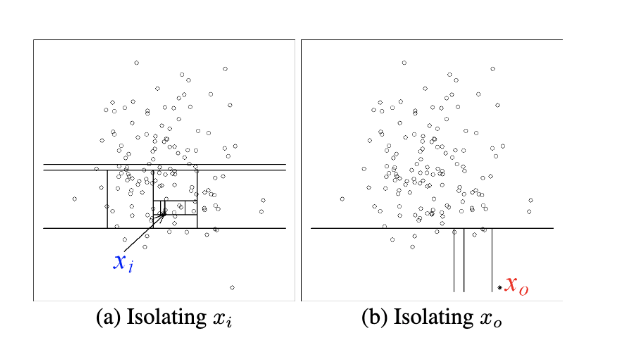

# Isolation Forest
Implementation of iForest Algorithm for Anomaly Detection based on original [paper](https://cs.nju.edu.cn/zhouzh/zhouzh.files/publication/icdm08b.pdf "Isolation Forest") by Fei Tony Liu, Kai Ming Ting and Zhi-Hua Zhou.

## How iForest Work
The idea behind Isolation Forest algorithm is that anomalies are "few and different" and, therefore, more susceptible to isolation.
The forest is based on decision trees of sub-sampled data. However, the decision split in an Isolation Tree is made by randomly selecting a feature and then randomly selecting a split value as opposed to minimizing MSE as in Decision Tree. 

 

 
In the chart above, you can see that to isolate the normal point xi it takes twelve random partitions, whereas it requires only four partitions to isolate an anomaly x0

We calculate path length for each point x which is measured by the number of edges from the root node to the external node with point x.
The random partitioning has a noticeable shorter **path length** for anomalies, thus when the forest of random trees has shorter path lengths for some points, then they are likely to be anomalous. The path length across all trees varies, therefore we calculate **anomaly score** to aggregate the lengths for a single point x. Anomaly score is bounded between 0 and 1. The higher the score, the most likely the point is anomalous.

## Limitations and Improvements
One of the known **weaknesses** of the original isolation forest algorithm is that it can't handle noisy data with many features. To tackle this, I wrote an **improved version** of the algorithm that chooses better features and better splits when creating the trees. 

I narrow my features to "good" features. I base my decision on the assumption that if there are outliers (anomalies) in the data, then the best feature to detect them would likely be not normally distributed. We know that, the median and the mean in a Gaussian distribution are equal. Thus, for all feature, I am calculating normalized difference between median and mean, and define a "good" feature as the one with the difference above a threshold. I choose threshold as an average of all differences between median and mean. My approach successfully eliminates noisy features.

Another improvement I have implemented is how I choose the spit point. Rather than randomly choosing, I am searching for the "best split" in a while loop by selecting a feature from "good" features and a split value between min and max. The best split is the one with the smallest left or right partition, meaning with the most isolation. 

[My implementation of iForest](https://github.com/katjawittfoth/Isolation_Forest/blob/master/iforest.py)
 
[Application and visualization of my algorithm on Cancer data](https://github.com/katjawittfoth/Isolation_Forest/blob/master/iForest_visualization.ipynb)

